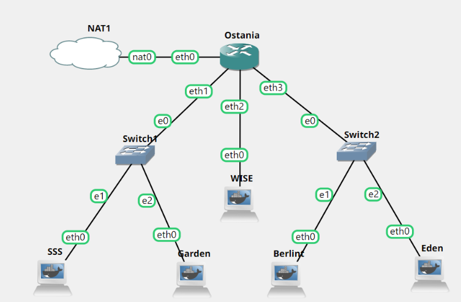

# Jarkom-Modul-2-ITB03-2022
---
Kelompok ITB03:
1. Haffif Rasya Fauzi - 5027201002
2. M. Hilmi Azis - 5027201049
3. Gennaro Fajar Mende - 5027201061
---

## Soal 1
WISE akan dijadikan sebagai DNS Master, Berlint akan dijadikan DNS Slave, dan Eden akan digunakan sebagai Web Server. Terdapat 2 Client yaitu SSS, dan Garden. Semua node terhubung pada router Ostania, sehingga dapat mengakses internet

### Jawab soal 1

