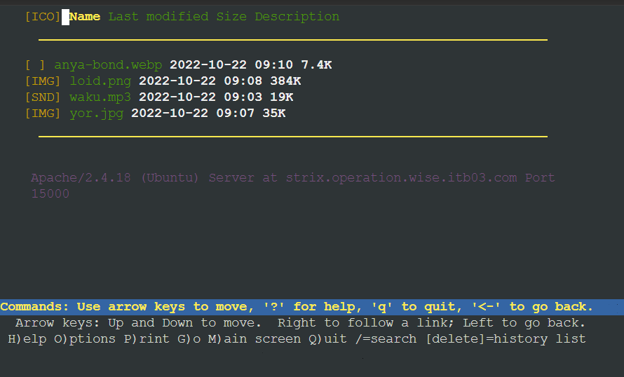

# Jarkom-Modul-2-ITB03-2022
---
Kelompok ITB03:
1. Haffif Rasya Fauzi - 5027201002
2. M. Hilmi Azis - 5027201049
3. Gennaro Fajar Mende - 5027201061
---

## **Soal 1**
---
WISE akan dijadikan sebagai DNS Master, Berlint akan dijadikan DNS Slave, dan Eden akan digunakan sebagai Web Server. Terdapat 2 Client yaitu SSS, dan Garden. Semua node terhubung pada router Ostania, sehingga dapat mengakses internet

### **Penyelesaian Soal 1**
Kami telah membuat topologi terlebih dahulu. untuk topologi yaitu sebagai berikut:


Lalu, disini kami akan melakukan konfigurasi pada setiap node.

Ostania sebagai router


**WISE sebagai DNS Server**


**Berlint sebagai DNS Slave**


**Eden sebagai Web Server**


**SSS sebagai Client**


**Garden sebagai Client**


Kemudian setiap node diaktifkan dengan mengklik tombol start. Setelah itu, menjalankan command `iptables -t nat -A POSTROUTING -o eth0 -j MASQUERADE -s 10.46.0.0/16` pada router Ostania upaya dapat terkoneksi dengan internet.


## **Soal 2**
---
Untuk mempermudah mendapatkan informasi mengenai misi dari Handler, bantulah Loid membuat website utama dengan akses wise.yyy.com dengan alias www.wise.yyy.com pada folder wise

### **Penyelesaian Soal 2**
#### **Server WISE**

Melakukan konfigurasi terhadap file `/etc/bind/named.conf.local` dengan menambahkan sebagai berikut:

```
zone "wise.itb03.com" {
        type master;
        file "/etc/bind/wise/wise.itb03.com";
};
```

kemudian, kami membuat direktori baru yaitu wise dengan command:<br>
`mkdir -p /etc/bind/wise`

Lalu, menambahkan konfigurasi pada `/etc/bind/wise/wise.itb03.com` dengan sebagai berikut:
```
$TTL    604800
@       IN      SOA     wise.itb03.com. root.wise.itb03.com. (
                              2         ; Serial
                         604800         ; Refresh
                          86400         ; Retry
                        2419200         ; Expire
                         604800 )       ; Negative Cache TTL
;
@             IN      NS      wise.itb03.com.
@             IN      A       10.46.2.2 ; IP WISE
@             IN      AAAA    ::1
www           IN      CNAME   wise.itb03.com.
```

Melakukan restart service bind9 dengan service bind9 restart

#### **Server Berlint**

Pada server Berlint lakukan command sebagai berikut:
```
apt-get update  
apt-get install dnsutils -y  
echo "nameserver 10.46.2.2" > /etc/resolv.conf 
``` 

### **Testing**
- ping wise.itb03.com -c 5


- ping www.wise.itb03.com -c 5


- host -t CNAME www.wise.itb03.com`


## **Soal 3**
---
Setelah itu ia juga ingin membuat subdomain eden.wise.yyy.com dengan alias www.eden.wise.yyy.com yang diatur DNS-nya di WISE dan mengarah ke Eden.

### **Penyelesaian Soal 3**
#### **Server WISE**

Melakukan Edit pada file `/etc/bind/wise/wise.itb03.com` menjadi seperti berikut:

```
$TTL    604800
@       IN      SOA     wise.itb03.com. root.wise.itb03.com. (
                              2         ; Serial
                         604800         ; Refresh
                          86400         ; Retry
                        2419200         ; Expire
                         604800 )       ; Negative Cache TTL
;
@             IN      NS      wise.itb03.com.
@             IN      A       10.46.2.2 ; IP WISE
@             IN      AAAA    ::1
www           IN      CNAME   wise.itb03.com.
eden          IN      A       10.46.3.3 ; IP Eden
www.eden      IN      CNAME   eden.wise.itb03.com
```

Melakukan restart sevice bind9 dengan `service bind9 restart`

### **Testing**
- ping eden.wise.itb03.com -c 5


- ping www.eden.wise.itb03.com -c 5


- host -t A eden.wise.itb03.com


- host -t CNAME www.eden.wise.itb03.com


## **Soal 4**
---
Buat juga reverse domain untuk domain utama

### **Penyelesaian Soal 4**
#### **Server WISE**

Edit file `/etc/bind/named.conf.local` menjadi sebagai berikut:

```
zone "wise.itb03.com"{
        type master;
        file "/etc/bind/wise/wise.itb03.com";
};

zone "2.46.10.in-addr.arpa" {
        type master;
        file "/etc/bind/wise/2.46.10.in-addr.arpa";
};
```

Lalu, lakukan konfigurasi pada file `/etc/bind/bind/2.46.10.in-addr.arpa` seperti berikut ini:

```
$TTL    604800
@       IN      SOA     wise.itb03.com. root.wise.itb03.com. (
                              2         ; Serial
                         604800         ; Refresh
                          86400         ; Retry
                        2419200         ; Expire
                         604800 )       ; Negative Cache TTL
;
2.46.10.in-addr.arpa.   IN      NS      wise.itb03.com.
2                       IN      PTR     wise.itb03.com.
```

### **Testing**
- host -t PTR 10.46.2.2


## **Soal 5**
---
Agar dapat tetap dihubungi jika server WISE bermasalah, buatlah juga Berlint sebagai DNS Slave untuk domain utama

### **Penyelesaian Soal 5**
kami melakukan konfigurasi pada file `/etc/bind/named.conf.local` sebagai berikut untuk melakukan konfigurasi DNS Slave yang mengarah ke `Berlint`:

```
zone "wise.itb03.com"{
        type master;
        notify yes;
        also-notify { 10.46.3.2; };
        allow-transfer { 10.46.3.2; };
        file "/etc/bind/wise/wise.itb03.com";
};

zone "2.46.10.in-addr.arpa" {
        type master;
        file "/etc/bind/wise/2.46.10.in-addr.arpa";
};
```

Lalu, restart service bind9 dengan `service bind9 restart`

#### **Server Berlint**
Melakukan `apt-get update` dan lakukan terlebih dahulu, dan install bind9 dengan cara `apt-get install bind9 -y`. Hal tersebut dikarenakan `Berlint` akan dijadikan DNS Slave. Setelah itu, lakukan konfigurasi pada file `/etc/bind/named.conf.local` seperti berikut:

```
zone "wise.itb03.com" {
    type slave;
    masters { 10.46.2.2; }; // Masukan IP WISE tanpa tanda petik
    file "/var/lib/bind/wise.itb03.com";
};
```

Lalu, restart seevice bind9 kembali dengan `service bind9 restart`

### **Testing**
- Lakukan `service bind9 stop` terlebih dahulu pada server WISE.


- Melakukan ping pada Garden


## **Soal 6**
---
Karena banyak informasi dari Handler, buatlah subdomain yang khusus untuk operation yaitu operation.wise.yyy.com dengan alias www.operation.wise.yyy.com yang didelegasikan dari WISE ke Berlint dengan IP menuju ke Eden dalam folder operation 

### **Penyelesaian Soal 6**
#### **Server WISE**
Kami mengatur konfigurasi di `/etc/bind/wise/wise.itb03`.com untuk membuat subdomain `operation.wise.itb03.com` dan memberi alias menjadi `www.operation.wise.itb03.com` seperti berikut:

```
$TTL    604800
@       IN      SOA     wise.itb03.com. root.wise.itb03.com. (
                              2         ; Serial
                         604800         ; Refresh
                          86400         ; Retry
                        2419200         ; Expire
                         604800 )       ; Negative Cache TTL
;
@             IN      NS      wise.itb03.com.
@             IN      A       10.46.2.2 ; IP WISE
@             IN      AAAA    ::1
www           IN      CNAME   wise.itb03.com.
eden          IN      A       10.46.3.3 ; IP Eden
www.eden      IN      CNAME   eden.wise.itb03.com.
ns1           IN      A       10.46.3.2 ; IP Berlint
operation     IN      NS      ns1
www.operation IN      CNAME   wise.itb03.com
```

Kemudian kami juga mengganti konfigurasi option pada `/etc/bind/named.conf.options` seperti berikut:

```
options {
        directory "/var/cache/bind";
        allow-query{any;};
        auth-nxdomain no;    # conform to RFC1035
        listen-on-v6 { any; };
};
```

Dan mengedit konfigurasi di `/etc/bind/named.conf.local` seperti berikut:

```
zone "wise.itb03.com"{
        type master;
        //notify yes;
        //also-notify { 10.46.3.2; };
        allow-transfer { 10.46.3.2; };
        file "/etc/bind/wise/wise.itb03.com";
};

zone "2.46.10.in-addr.arpa" {
        type master;
        file "/etc/bind/wise/2.46.10.in-addr.arpa";
};
```

Lalu, restart service bind9 dengan `service bind9 restart`

#### **Server Berlint**
Kami akan mengedit konfigurasi optionnya pada `/etc/bind/named.conf.options` seperti berikut:

```
options {
        directory "/var/cache/bind";
        allow-query{any;};
        auth-nxdomain no;    # conform to RFC1035
        listen-on-v6 { any; };
};
```

Kemudian edit file `/etc/bind/named.conf.local` untuk delegasi `operation.wise.itb03.com`:

```
zone "wise.itb03.com" {
    type slave;
    masters { 10.46.2.2; }; // Masukan IP WISE tanpa tanda petik
    file "/var/lib/bind/wise.itb03.com";
};

zone "operation.wise.itb03.com" {
        type master;
        file "/etc/bind/operation/operation.wise.itb03.com";
};
```

buat sebuah direktori `mkdir -p /etc/bind/operation` dan Lakukan konfigurasi pada file `/etc/bind/operation/operation.wise.itb03.com` :

```

$TTL    604800
@       IN      SOA     operation.wise.itb03.com. root.operation.wise.itb03.com$
                              2         ; Serial
                         604800         ; Refresh
                          86400         ; Retry
                        2419200         ; Expire
                         604800 )       ; Negative Cache TTL
;
@          IN      NS      operation.wise.itb03.com.
@          IN      A       10.46.3.3 ; IP Eden
www        IN      CNAME   operation.wise.itb03.com.
```

Lalu, restart service bind9 dengan `service bind9 restart`

### **Testing**
- ping operation.wise.itb03.com -c 3


- ping www.operation.wise.itb03.com -c


## **Soal 7**
---
Untuk informasi yang lebih spesifik mengenai Operation Strix, buatlah subdomain melalui Berlint dengan akses strix.operation.wise.yyy.com dengan alias www.strix.operation.wise.yyy.com yang mengarah ke Eden

### **Penyelesaian Soal 7**
#### **Server Berlint**
konfigurasi file `/etc/bind/operation/operation.wise.itb03.com` sebagai berikut:

```
$TTL    604800
@       IN      SOA     operation.wise.itb03.com. root.operation.wise.itb03.com$
                              2         ; Serial
                         604800         ; Refresh
                          86400         ; Retry
                        2419200         ; Expire
                         604800 )       ; Negative Cache TTL
;
@          IN      NS      operation.wise.itb03.com.
@          IN      A       10.46.3.3 ; IP Eden
www        IN      CNAME   operation.wise.itb03.com.
strix      IN      A       10.46.3.3 ; IP Eden
www.strix  IN      CNAME   strix.operation.wise.itb03.com.
```

Lalu, restart service bind9 dengan `service bind9 restart`

### **Testing**
- ping strix.operation.wise.itb03.com -c 3


- ping www.strix.operation.wise.itb03.com -c 3


- host -t A strix.operation.wise.itb03.com


- host -t CNAME www.strix.operation.wise.itb03.com


## **Soal 8**
---
Setelah melakukan konfigurasi server, maka dilakukan konfigurasi Webserver. Pertama dengan webserver www.wise.yyy.com. Pertama, Loid membutuhkan webserver dengan DocumentRoot pada /var/www/wise.yyy.com

### **Penyelesaian Soal 8**
#### **Client SSS**
Melakukan installasi lynx pada SSS dengan command:

```
apt-get update
apt-get install lynx -y
```

#### **Server Eden**
Melakukan installasi apache, php, dan unzip, dengan command sebagai berikut:

```
apt update
apt install unzip -y
apache2-utils -y
apache2 -y
php -y
libapache2-mod-php7.0 -y
service apache2 start
```

konfigurasi file `/etc/apache2/sites-available/wise.itb03.com.conf`. DocumentRoot diletakkan di `/var/www/wise.itb03.com/`. Jangan lupa untuk menambahkan servername dan serveralias.

```
<VirtualHost *:80>
        ServerAdmin webmaster@localhost
        DocumentRoot /var/www/wise.itb03.com
        ServerName wise.itb03.com
        ServerAlias www.wise.itb03.com

        //Alias /home /var/www/wise.itb03.com/index.php/home

        <Directory /var/www/wise.itb03.com>
                Options +FollowSymLinks -Multiviews
                AllowOverride All
        </Directory>

        ErrorLog ${APACHE_LOG_DIR}/error.log
        CustomLog ${APACHE_LOG_DIR}/access.log combined

</VirtualHost>
```

Lalu lakukan membaut sebuah direktori root untuk server `wise.itb03.com` dan memindahkan folder wise dalam root pada `/var/www/wise.itb03.com/`

```
mkdir -p  `/var/www/wise.itb03.com/`
mv wise/ /var/www/wise.itb03.com/
service apache2 restart
```

### **Testing**
- lynx wise.itb03.com 


- lynx www.wise.itb03.com 


## **Soal 9**
---
Setelah itu, Loid juga membutuhkan agar url www.wise.yyy.com/index.php/home dapat menjadi menjadi www.wise.yyy.com/home

### **Penyelesaian Soal 9**
Lakukan `a2enmod rewrite` terlebih dahulu dan restart apache sebagai berikut:

```
a2enmod rewrite
service apache2 restart
```

konfigurasi file `/var/www/wise.itb03.com/.htaccess` sebagai berikut:

```
RewriteEngine On
RewriteCond %{REQUEST_FILENAME} !-f
RewriteCond %{REQUEST_FILENAME} !-d
RewriteRule (.*) /index.php/$1 [L]
```

Inti dari konfigurasi tersebut yaitu akan melakukan pemeriksaan apakah request tersebut menuju ke file atau bukan dan ke direktori atau bukan. Jika hal tersebut terpenuhi, maka akan membuat rule untuk melakukan direct ke /index.php/home. `$1` merupakan parameter yang diinputkan di url konfigurasi file `/etc/apache2/sites-available/wise.itb03.com.conf` dan menggunakan alias agar dapat menjadi `www.wise.itb03.com/home` sebagai berikut

```
<VirtualHost *:80>
        ServerAdmin webmaster@localhost
        DocumentRoot /var/www/wise.itb03.com
        ServerName wise.itb03.com
        ServerAlias www.wise.itb03.com

        Alias /home /var/www/wise.itb03.com/index.php/home

        <Directory /var/www/wise.itb03.com>
                Options +FollowSymLinks -Multiviews
                AllowOverride All
        </Directory>

        ErrorLog ${APACHE_LOG_DIR}/error.log
        CustomLog ${APACHE_LOG_DIR}/access.log combined

</VirtualHost>
```

Melakukan restart service apache2 dengan `service apache2 restart`

### **Testing**
- www.wise.itb03.com/home


## **Soal 10**
---
Setelah itu, pada subdomain www.eden.wise.yyy.com, Loid membutuhkan penyimpanan aset yang memiliki DocumentRoot pada /var/www/eden.wise.yyy.com

### **Penyelesaian Soal 10**
konfigurasi file `/etc/apache2/sites-available/eden.wise.itb03.com.conf` sebagai berikut:

```
<VirtualHost *:80>
        ServerAdmin webmaster@localhost
        DocumentRoot /var/www/eden.wise.itb03.com
        ServerName eden.wise.itb03.com
        ServerAlias www.eden.wise.itb03.com

        ErrorLog ${APACHE_LOG_DIR}/error.log
        CustomLog ${APACHE_LOG_DIR}/access.log combined

        <Directory /var/www/eden.wise.itb03.com>
                Options +FollowSymLinks -Multiviews
                AllowOverride All
        </Directory>
</VirtualHost>
```

Lalu aktifkan virtualhost dengan a2ensite serta membuat sebuah direktori untuk documentroot dari subdomain `eden.wise.itb03.com` dan memindahkan folder `eden.wise` dalam root pada `/var/www/eden.wise.itb03.com/`.

```
a2ensite eden.wise.itb03.com
mkdir -p  `/var/www/eden.wise.itb03.com/`
mv eden.wise/ /var/www/eden.wise.itb03.com/
service apache2 restart
```

### **Testing**
- lynx eden.wise.itb03.com


## **Soal 11**
---
Akan tetapi, pada folder /public, Loid ingin hanya dapat melakukan directory listing saja

### **Penyelesaian Soal 11**
konfigurasi file` /etc/apache2/sites-available/eden.wise.itb03.com.conf` menambahkan `Options +Indexes` ke direktori yang ingin di directory list dengan sebagai berikut:

```
<VirtualHost *:80>
        ServerAdmin webmaster@localhost
        DocumentRoot /var/www/eden.wise.itb03.com
        ServerName eden.wise.itb03.com
        ServerAlias www.eden.wise.itb03.com

        <Directory /var/www/eden.wise.itb03.com/public>
                Options +Indexes
        </Directory>

        ErrorLog ${APACHE_LOG_DIR}/error.log
        CustomLog ${APACHE_LOG_DIR}/access.log combined

        <Directory /var/www/eden.wise.itb03.com>
                Options +FollowSymLinks -Multiviews
                AllowOverride All
        </Directory>
</VirtualHost>
```

Melakukan restart service apache2 dengan `service apache2 restart`

### **Testing**
- lynx www.eden.wise.itb03.com/public


## **Soal 12**
---
Tidak hanya itu, Loid juga ingin menyiapkan error file 404.html pada folder /error untuk mengganti error kode pada apache.

### **Penyelesaian Soal 12**
#### **Server Eden**
konfigurasi file `/etc/apache2/sites-available/eden.wise.itb03.com.conf` menambahkan konfigurasi ErrorDocument untuk setiap error yang ada yang diarahkan ke file /error/404.html dengan sebagai berikut:

```
<VirtualHost *:80>
        ServerAdmin webmaster@localhost
        DocumentRoot /var/www/eden.wise.itb03.com
        ServerName eden.wise.itb03.com
        ServerAlias www.eden.wise.itb03.com

        ErrorDocument 404 /error/404.html
        ErrorDocument 500 /error/404.html
        ErrorDocument 502 /error/404.html
        ErrorDocument 503 /error/404.html
        ErrorDocument 504 /error/404.html

        <Directory /var/www/eden.wise.itb03.com/public>
                Options +Indexes
        </Directory>

        ErrorLog ${APACHE_LOG_DIR}/error.log
        CustomLog ${APACHE_LOG_DIR}/access.log combined

        <Directory /var/www/eden.wise.itb03.com>
                Options +FollowSymLinks -Multiviews
                AllowOverride All
        </Directory>
</VirtualHost>
```

Melakukan restart service apache2 dengan `service apache2 restart`

### **Testing**
- lynx www.eden.wise.itb03.com/hehehe


## **Soal 13**
---
Loid juga meminta Franky untuk dibuatkan konfigurasi virtual host. Virtual host ini bertujuan untuk dapat mengakses file asset www.eden.wise.yyy.com/public/js menjadi www.eden.wise.yyy.com/js

### **Penyelesaian Soal 13**
#### **Server Eden**
Pada Eden kami akan melakukan edit konfigurasi pada `/etc/apache2/sites-available/eden.wise.itb03.com.conf` sebagai berikut:

```
<VirtualHost *:80>
        ServerAdmin webmaster@localhost
        DocumentRoot /var/www/eden.wise.itb03.com
        ServerName eden.wise.itb03.com
        ServerAlias www.eden.wise.itb03.com

        ErrorDocument 404 /error/404.html
        ErrorDocument 500 /error/404.html
        ErrorDocument 502 /error/404.html
        ErrorDocument 503 /error/404.html
        ErrorDocument 504 /error/404.html

        <Directory /var/www/eden.wise.itb03.com/public>
                Options +Indexes
        </Directory>

        Alias "/js" "/var/www/eden.wise.itb03.com/public/js"

        ErrorLog ${APACHE_LOG_DIR}/error.log
        CustomLog ${APACHE_LOG_DIR}/access.log combined

        <Directory /var/www/eden.wise.itb03.com>
                Options +FollowSymLinks -Multiviews
                AllowOverride All
        </Directory>
</VirtualHost>
```

Pada `Alias "/js" "/var/www/eden.wise.itb03.com/public/js"` akan mentranslate direktori `/js` menjadi `/public/js`.

Lalu melakukan restart service apache2 dengan `service apache2 restart`

### **Testing**
- lynx www.eden.wise.itb03.com/js  


## **Soal 14**
---
Loid meminta agar www.strix.operation.wise.yyy.com hanya bisa diakses dengan port 15000 dan port 15500

### **Penyelesaian Soal 14**
#### **Server Eden**
Konfigurasi file `/etc/apache2/sites-available/strix.operation.wise.itb03.com.conf`. Disini kami akan menambahkan VirtualHost baru yang berada pada port 15000 dan 15500 dengan sebagai berikut:
```
<VirtualHost *:15000 *:15500>
        ServerAdmin webmaster@localhost
        DocumentRoot /var/www/strix.operation.wise.itb03.com
        ServerName strix.operation.wise.itb03.com
        ServerAlias www.strix.operation.wise.itb03.com

        ErrorLog \${APACHE_LOG_DIR}/error.log
        CustomLog \${APACHE_LOG_DIR}/access.log combined
</VirtualHost>
```

Kemudian lakukan command sebagai berikut:

```
a2ensite strix.operation.wise.itb03.com
service apache2 restart
mkdir /var/www/strix.operation.wise.itb03.com
mv strix.operation.wise/* /var/www/strix.operation.wise.itb03.com/
```
Selanjutnya, konfigurasikan file `/etc/apache2/ports.conf `menambahkan Listen 15000 dan 15500 dengan sebagai berikut:

```
Listen 80
Listen 15000
Listen 15500
<IfModule ssl_module>
        Listen 443
</IfModule>

<IfModule mod_gnutls.c>
        Listen 443
</IfModule>
```

Melakukan restart service apache2 dengan command `service apache2 restart`

### **Testing**
- lynx strix.operation.wise.itb03.com:15000

- lynx strix.operation.wise.itb03.com:15500


## **Soal 15**
---
dengan autentikasi username Twilight dan password opStrix dan file di /var/www/strix.operation.wise.yyy

### **Penyelesaian Soal 15**
#### **Server Eden**
Kami menjalankan command `htpasswd -c -b /etc/apache2/.htpasswd Twilight opStrix`

Lalu, Konfigurasikan file `/etc/apache2/sites-available/strix.operation.wise.itb03.com.conf` dengan sebagai berikut:

```
<VirtualHost *:15000 *:15500>
        ServerAdmin webmaster@localhost
        DocumentRoot /var/www/strix.operation.wise.itb03.com
        ServerName strix.operation.wise.itb03.com
        ServerAlias www.strix.operation.wise.itb03.com

        <Directory \"/var/www/strix.operation.wise.itb03.com\">
                AuthType Basic
                AuthName \"Restricted Content\"
                AuthUserFile /etc/apache2/.htpasswd
                Require valid-user
        </Directory>

        ErrorLog \${APACHE_LOG_DIR}/error.log
        CustomLog \${APACHE_LOG_DIR}/access.log combined
</VirtualHost>
```

Melakukan restart service apache2 dengan command `service apache2 restart`

### **Testing**
- lynx strix.operation.wise.itb03.com:15000

## **Soal 16**
---
dan setiap kali mengakses IP Eden akan dialihkan secara otomatis ke www.wise.yyy.com

### **Penyelesaian Soal 16**
#### **Server Eden**
Melakukan konfigurasi file /etc/apache2/sites-available/000-default.conf dengan sebagai berikut:

```
<VirtualHost *:80>
        ServerAdmin webmaster@localhost
        DocumentRoot /var/www/html
        RewriteEngine On
        RewriteCond %{HTTP_HOST} !^wise.itb03.com$
        RewriteRule /.* http://wise.itb03.com/ [R]
        ErrorLog ${APACHE_LOG_DIR}/error.log
        CustomLog ${APACHE_LOG_DIR}/access.log combined
</VirtualHost>
```
Dan melakukan restart service apache2 dengan command `service apache2 restart`

### **Testing**
- Pada Terminal SSS

- lynx 10.46.3.3


## **Soal 17**
---
Karena website www.eden.wise.yyy.com semakin banyak pengunjung dan banyak modifikasi sehingga banyak gambar-gambar yang random, maka Loid ingin mengubah request gambar yang memiliki substring “eden” akan diarahkan menuju eden.png. Bantulah Agent Twilight dan Organisasi WISE menjaga perdamaian!

### **Penyelesaian Soal 17**
#### **Server Eden**
konfigurasi file `/var/www/eden.wise.itb03.com/.htaccess` dengan sebagai berikut:
```
RewriteEngine On
RewriteCond %{REQUEST_URI} ^/public/images/(.*)eden(.*)
RewriteCond %{REQUEST_URI} !/public/images/eden.png
RewriteRule /.* http://eden.wise.itb03.com/public/images/eden.png [L]
```

konfigurasi file `/etc/apache2/sites-available/eden.wise.itb03.com.conf` dengan sebagai berikut:
```
<VirtualHost *:80>
        ServerAdmin webmaster@localhost
        DocumentRoot /var/www/eden.wise.itb03.com
        ServerName eden.wise.itb03.com
        ServerAlias www.eden.wise.itb03.com
        ErrorDocument 404 /error/404.html
        ErrorDocument 500 /error/404.html
        ErrorDocument 502 /error/404.html
        ErrorDocument 503 /error/404.html
        ErrorDocument 504 /error/404.html
        <Directory /var/www/eden.wise.itb03.com/public>
                Options +Indexes
        </Directory>
        Alias "/js" "/var/www/eden.wise.itb03.com/public/js"
        <Directory /var/www/eden.wise.itb03.com>
                Options +FollowSymLinks -Multiviews
                AllowOverride All
        </Directory>
        ErrorLog ${APACHE_LOG_DIR}/error.log
        CustomLog ${APACHE_LOG_DIR}/access.log combined
        <Directory /var/www/eden.wise.itb03.com>
                Options +FollowSymLinks -Multiviews
                AllowOverride All
        </Directory>
</VirtualHost>
```

Dam melakukan restart service apache2 dengan `service apache2 restart`

### **Testing**
- lynx eden.wise.itb03.com/public/images/HAHAHAHeden

- Hasil Download pada Client SSS


## **Kendala**
---
Tidak Ada


